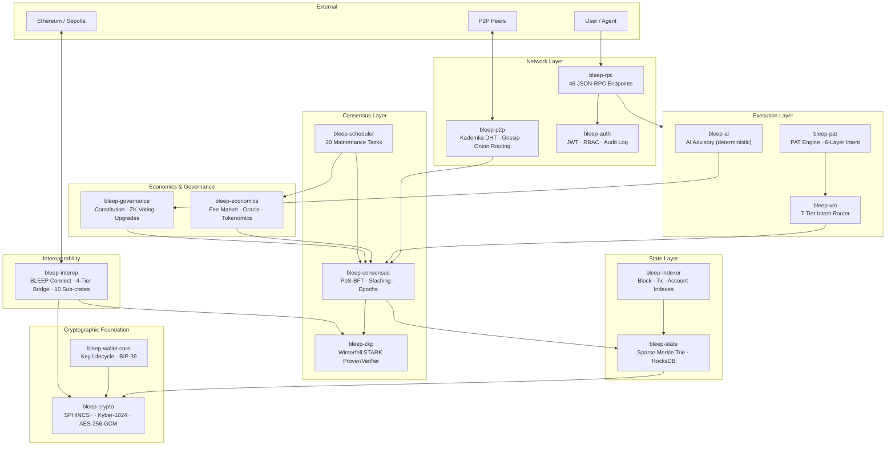
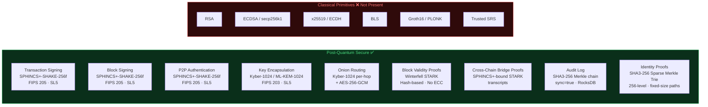
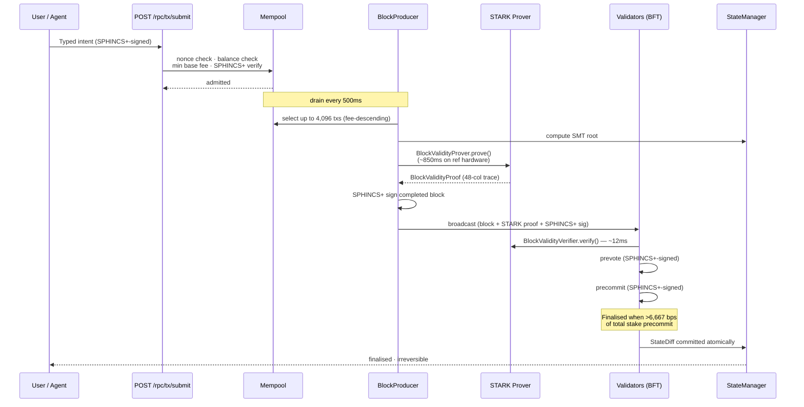

<div align="center">

# BLEEP · Quantum Trust Network

### Proven Execution. Quantum Foundation. Intent Native.

*The first execution network where every block ships with a mathematical proof of its own correctness — built post-quantum from genesis, no migration required.*

**[Website](https://www.bleepecosystem.com) · [Whitepaper](WHITEPAPER.md) · [Roadmap](ROADMAP.md) · [Discord](https://discord.gg/bleepecosystem) · [Telegram](https://t.me/bleepecosystem) · [Build Guide](BUILDING.md)**

</div>

---

## What is BLEEP?

BLEEP is a distributed execution protocol built on three invariants: every block ships with a cryptographic proof of its own correctness, every instruction is expressed as intent rather than bytecode, and the entire cryptographic foundation survives a quantum computer — by construction, from genesis.
Every block produced by BLEEP includes a Winterfell STARK proof of its own validity — generated before broadcast, verified independently by every validator, requiring no trusted setup and no privileged operator. Transaction signing, peer authentication, key encapsulation, and zero-knowledge proof verification are each secured exclusively by NIST-finalised post-quantum standards — FIPS 205 (SPHINCS+) and FIPS 203 (Kyber-1024/ML-KEM-1024) — at Security Level 5.


BLEEP is post-quantum from genesis. There is no classical fallback. There is no migration path needed — because the problem was solved before the protocol accumulated economic value and ecosystem dependencies.


| The harvest-now, decrypt-later threat is real and accumulating. Every signed transaction on a classically secured blockchain is a permanent public record. An adversary can archive those records today and apply quantum decryption retroactively when capable hardware arrives. BLEEP's historical record carries no such liability — by design.|

## Four Properties. No Other Network Has All Four.

| Property | What it means | How it's implemented |
|---|---|---|
| **Proven Execution** | Every block ships with a cryptographic proof of correctness | Winterfell STARK `BlockValidityProof` — generated pre-broadcast, verified pre-vote |
| **Intent Native** | Users and agents express outcomes, not instructions | PAT engine + 7-tier VM router — intent resolved to optimal execution path automatically |
| **Quantum Foundation** | No classical public-key primitive on any sensitive path | SPHINCS+ (FIPS 205) + Kyber-1024 (FIPS 203) at Security Level 5 — from block zero |
| **Constitutional Integrity** | Supply cap, inflation ceiling, finality threshold cannot be changed by anyone | Rust `const_assert!` — violations do not compile |

---

## How BLEEP Compares

| Property | Non-PQ chains | Naoris Protocol | BLEEP |
|---|---|---|---|
| Transaction signing | ECDSA — broken by Shor's | Dilithium-5 overlay | SPHINCS+-SHAKE-256f (FIPS 205, SL5) — native |
| Key encapsulation | ECDH / x25519 — broken by Shor's | Additive layer | Kyber-1024 / ML-KEM-1024 (FIPS 203, SL5) — native |
| ZK proof system | Groth16 / PLONK — trusted setup | Not applicable | Winterfell STARK — transparent, no ceremony |
| Block validity | Assumed | Not proven | **Proven — STARK proof per block** |
| Intent execution | Not supported | Not supported | **Native — PAT engine + 7-tier VM** |
| Quantum migration | Required (coordination risk) | Overlay — doesn't fix base chain | **Not needed — PQ from genesis** |
| Supply cap enforcement | Governance-changeable | Governance-changeable | **Compile-time `const_assert`** |
| Trusted operators | Bridge multisigs | Centralised nodes | **None — 4-tier trustless bridge** |

---

## Why Not Migrate Later?

A protocol that launches with classical cryptography and plans a post-quantum migration inherits a coordination problem that history shows cannot be cleanly solved. Validators, wallets, bridges, indexers, and all tooling must upgrade simultaneously. HTTPS migration took over a decade and is still incomplete.

**BLEEP eliminates this problem by not having it.** Post-quantum from genesis means no migration coordination, no ecosystem split, no retroactive cryptographic liability.

---

## Quick Start

### Prerequisites

```bash
# Ubuntu / Debian
sudo apt-get update && sudo apt-get install -y \
  build-essential cmake clang libclang-dev \
  libssl-dev pkg-config librocksdb-dev \
  protobuf-compiler perl nasm

# Rust toolchain (reads rust-toolchain.toml automatically)
curl --proto '=https' --tlsv1.2 -sSf https://sh.rustup.rs | sh
source "$HOME/.cargo/env"
```

### Run a Node

```bash
git clone https://github.com/BleepEcosystem/BLEEP-v1.git
cd BLEEP-v1
cargo run --release
```

**16-step startup sequence (Protocol Version 5):**

```
[1/16]  ✅ SPHINCS+-SHAKE-256f-simple keypair (PK=64 bytes, SK=128 bytes — FIPS 205 SL5)
[1/16]  ✅ Kyber-1024 keypair (PK=1,568 bytes — FIPS 203 SL5)
[2/16]  ✅ Genesis block #0 — blockchain, mempool, tx-pool ready
[3/16]  ✅ Wallet services online
[4/16]  ✅ PAT engine running (6-layer intent-driven architecture)
[5/16]  ✅ AI advisory ready (deterministic mode, governance-gated)
[6/16]  ✅ Governance online (1B total stake)
[7/16]  ✅ ValidatorRegistry + SlashingEngine initialised
[8/16]  ✅ STARK prover/verifier ready — no trusted setup required
        ✅ STARK block circuit ready (48-column trace, f128 field)
        ✅ STARK batch tx circuit ready
[9/16]  ✅ BleepEconomicsRuntime — fee market, oracle, emission schedule
[10/16] ✅ BLEEP Connect: ETH, BSC, SOL, COSMOS, DOT adapters registered
[11/16] ✅ Telemetry (Prometheus-compatible) active
[12/16] ✅ P2P node listening on 0.0.0.0:7700
[13/16] ✅ MempoolBridge active (500ms drain cycle)
[14/16] ✅ BlockProducer online (3s slots, PoS-BFT, STARK proofs, P2P gossip)
[15/16] ✅ Consensus engine — PoS-Normal mode
[16/16] ✅ JSON-RPC server on 0.0.0.0:8545 — 46 endpoints active
```

### Configure Sepolia Bridge

```bash
# Set a real deployed Sepolia contract address (0x + 40 hex chars)
# The node will warn at startup if this is missing or malformed
export SEPOLIA_BLEEP_FULFILL_ADDR=0x<your_deployed_contract>
export SEPOLIA_RPC_URL=https://...
cargo run --release
```

### Run the Interchain Demo

```bash
bash ./demo_interchain.sh
```

### Run the TPS Benchmark

```bash
bash ./test_tps.sh
```

---

## Architecture

BLEEP is a **29-crate Cargo workspace** with an acyclic dependency graph enforced at build time. Each crate has a single defined responsibility. A vulnerability in networking cannot directly access private key material. A change to execution cannot modify cryptographic behaviour.

### System Overview



### Workspace Crates

```
crates/
├── bleep-core            # Block types, ZKTransaction, mempool, shared data structures
├── bleep-crypto          # SPHINCS+, Kyber-1024, AES-256-GCM, SHA3-256, BLAKE3
├── bleep-zkp             # Winterfell STARK block validity circuit — BlockValidityProver/Verifier
├── bleep-consensus       # PoS-BFT (primary), PBFT, PoW fallback; slashing; epoch management
├── bleep-state           # Sparse Merkle Trie (256-level), RocksDB, cross-shard 2PC, self-healing
├── bleep-vm              # 7-tier intent-driven VM: Native/Router/EVM/WASM/STARK/AI/Cross-Chain
├── bleep-pat             # Programmable Asset Token engine — 6-layer intent-driven architecture
├── bleep-ai              # Deterministic AI advisory — AIConstraintValidator, DeterministicInferenceEngine
├── bleep-p2p             # Kademlia DHT (k=20), Plumtree gossip (fanout=8), onion routing
├── bleep-rpc             # 46 JSON-RPC endpoints — health, state, proof, governance, bridge, AI
├── bleep-auth            # Credentials, JWT, RBAC, tamper-evident audit log, validator binding
├── bleep-scheduler       # 20 built-in protocol maintenance tasks
├── bleep-economics       # Tokenomics, EIP-1559-style fee market, validator incentives, oracle bridge
├── bleep-governance      # Constitution, ZK voting, proposal lifecycle, forkless upgrades
├── bleep-indexer         # Block, Tx, Account, Governance, Validator, Shard indexes
├── bleep-wallet-core     # SPHINCS+ key management, BIP-39 wallets, transaction signing
├── bleep-telemetry       # Prometheus-compatible metrics, load balancer
├── bleep-cli             # Validator staking, governance, AI, ZKP, faucet commands
├── bleep-interop/        # BLEEP Connect — 10 sub-crates across 4 bridge tiers
│   ├── bleep-connect-types
│   ├── bleep-connect-crypto
│   ├── bleep-connect-adapters
│   ├── bleep-connect-commitment-chain
│   ├── bleep-connect-executor
│   ├── bleep-connect-layer1-social
│   ├── bleep-connect-layer2-fullnode
│   ├── bleep-connect-layer3-zkproof
│   ├── bleep-connect-layer4-instant
│   └── bleep-connect-core
```

### Subsystem Map

| Subsystem | Crates | Responsibility |
|---|---|---|
| **Cryptography** | `bleep-crypto`, `bleep-zkp`, `bleep-wallet-core` | PQ signatures, KEM, STARK proofs, key lifecycle |
| **Consensus** | `bleep-consensus`, `bleep-scheduler` | Block production, STARK proof pipeline, finality, slashing |
| **State** | `bleep-state`, `bleep-indexer` | Sparse Merkle Trie, RocksDB, shard lifecycle, self-healing |
| **Execution** | `bleep-vm`, `bleep-pat`, `bleep-ai` | Multi-engine VM, intent resolution, deterministic AI advisory |
| **Network** | `bleep-p2p`, `bleep-rpc`, `bleep-auth` | Node discovery, gossip, onion routing, authentication |
| **Interop** | `bleep-interop` (10 sub-crates) | 4-tier cross-chain bridge, intent pool, ZK proof relay |
| **Economics** | `bleep-economics`, `bleep-governance` | Tokenomics, fee market, ZK voting, forkless upgrades |

---

## Cryptographic Model

All cryptography on sensitive paths is post-quantum. No classical fallback exists.

### Post-Quantum Boundary



### Signature Scheme — SPHINCS+-SHAKE-256f-simple (FIPS 205 / SLH-DSA)

| Parameter | Value |
|---|---|
| NIST Standard | FIPS 205 (SLH-DSA) |
| Security Level | 5 — ≥256-bit post-quantum security |
| Security Assumption | One-wayness of SHAKE-256 (hash-based) |
| Public Key | **64 bytes** |
| Secret Key | **128 bytes** (`Zeroizing<Vec<u8>>` — zeroed on drop) |
| Signature | **49,856 bytes** |
| Crate | `pqcrypto-sphincsplus` v0.7.2 |
| Usage | Transaction signing, block signing, P2P message authentication |

> **Bandwidth:** SPHINCS+ signatures are 49,856 bytes each. Raw per-block signature data at 512 tx/block is ~24.3 MB. The **Signature Availability Layer** (live in Protocol Version 5) reduces block-gossip bandwidth to **~320 KB per block (~98.7% reduction)** by replacing per-transaction signature propagation with a Blake3 Merkle commitment (`sig_commitment_root`) bound into the SPHINCS+ block signature and the 68-column extended STARK proof. Individual signatures are available on demand from the SAL gossip store.

### Key Encapsulation — Kyber-1024 / ML-KEM-1024 (FIPS 203)

| Parameter | Value |
|---|---|
| NIST Standard | FIPS 203 (ML-KEM) |
| Security Level | 5 — ≥256-bit post-quantum security |
| Security Assumption | Hardness of Module-LWE (lattice-based) |
| Public Key | 1,568 bytes |
| Secret Key | 3,168 bytes (`Zeroizing<Vec<u8>>` — zeroed on drop) |
| Ciphertext | 1,568 bytes + 32-byte shared secret |
| Crate | `pqcrypto-kyber` v0.8.1 |
| Usage | Validator binding, peer KEM, wallet key management, onion routing |

### Zero-Knowledge Proofs — Winterfell STARK (FRI-based)

| Property | Value |
|---|---|
| Construction | FRI-based STARK over 128-bit prime field |
| Trusted Setup | **None** — fully transparent |
| Post-Quantum Secure | Yes — reduces to collision resistance of BLAKE3 / SHA3-256 |
| Trace Width | 48 columns |
| Public Inputs | `block_index`, `epoch_id`, `tx_count`, `merkle_root_hash`, `validator_pk_hash` |
| Proof Generation | ~850 ms on reference hardware (8-core, 32 GB RAM) |
| Proof Verification | ~12 ms |
| Slot Budget | 3,000 ms — proof generation fits within one slot |
| Crate | `winterfell` v0.13.1 |
| Usage | Block validity proofs, cross-chain bridge verification (Tier 3) |

---

## Execution Model

### 7-Tier Intent-Driven VM

BLEEP's VM resolves **intent** — not bytecode. Callers declare *what* they want. The Router (Tier 2) determines *how* it executes, selecting the optimal engine automatically.

```mermaid
flowchart TD
    INTENT["Typed Intent Struct\n(caller declares outcome)"]

    INTENT --> T2

    subgraph DISPATCH["VM Router — bleep-vm/src/router/vm_router.rs"]
        T2["Tier 2 · Router\nIntent parsing · Engine selection\nCircuit breakers · Gas validation"]
    end

    T2 -->|"BLEEP transfer\nstake · vote"| T1["Tier 1 · Native\nNo gas · Direct state write"]
    T2 -->|"Solidity contract"| T3["Tier 3 · EVM\nrevm · Ethereum gas semantics"]
    T2 -->|"WASM contract"| T4["Tier 4 · WASM\nWasmer + Cranelift\nConfigurable fuel metering"]
    T2 -->|"ZK execution\nproof verification"| T5["Tier 5 · STARK\nWinterfell · Fixed cost per verifier op"]
    T2 -->|"Governance constraint\ncheck (advisory)"| T6["Tier 6 · AI-Advised\nDeterministic · No gas\nOff-chain only"]
    T2 -->|"Cross-chain intent\ninstant dispatch"| T7["Tier 7 · Cross-Chain\nBLEEP Connect Tier 4\nProtocol fee in bps"]

    T1 --> SD["StateDiff\n(isolated — no direct state write)"]
    T3 --> SD
    T4 --> SD
    T5 --> SD
    T6 --> SD
    T7 --> SD

    SD -->|"Committed atomically\nafter validator quorum"| STATE["bleep-state\nSparse Merkle Trie · RocksDB"]

    style DISPATCH fill:#1a1f2e,stroke:#4f6ef7
    style SD fill:#1a2a1a,stroke:#4ade80
```



### Transaction Lifecycle



---

## Consensus

### Validator Model

Every validator carries:
- A **SPHINCS+ verification key** — transaction and block signing
- A **Kyber-1024 encapsulation key** — peer channels and onion routing
- A **stake in microBLEEP** — determines vote weight and slashing exposure

**Safety guaranteed when Byzantine stake `f < S/3`** (total staked supply S).

### Consensus Pipeline

```mermaid
flowchart LR
    subgraph SLOT["3,000 ms Slot"]
        direction TB
        SEL["Proposer Selection\nStake-proportional VRF"]
        BP["BlockProducer\nSelect ≤4,096 txs\nCompute SMT root"]
        STARK["STARK Prover\n~850ms · 48-col trace\n5 public inputs"]
        SIGN["SPHINCS+ Block Sign\n49,856-byte signature"]
        BCAST["P2P Broadcast\nGossip fanout=8"]
    end

    subgraph VALIDATE["Validator Verification"]
        direction TB
        VSIG["Verify SPHINCS+ sig"]
        VZKP["Verify STARK proof\n~12ms"]
        VSMT["Verify SMT root transition"]
    end

    subgraph BFT["BFT Finality"]
        direction TB
        PREV["Prevote\n(SPHINCS+-signed)"]
        PREC["Precommit\n(SPHINCS+-signed)"]
        FIN["Finalise\n>6,667 bps stake\nIrreversible"]
    end

    SEL --> BP --> STARK --> SIGN --> BCAST
    BCAST --> VALIDATE
    VSIG --> VZKP --> VSMT
    VALIDATE --> BFT
    PREV --> PREC --> FIN

    NORMAL["PoS-Normal\n>67% validators online"] --> SEL
    EMERGENCY["Emergency (PBFT)\n<67% online\nSafety-first"] -.->|fallback| BP
    RECOVERY["Recovery (PoW)\nPost-partition re-anchor"] -.->|last resort| FIN

    style SLOT fill:#1a1f2e,stroke:#4f6ef7
    style VALIDATE fill:#1f1a2e,stroke:#a855f7
    style BFT fill:#1a2a1a,stroke:#4ade80
```



### Three Deterministic Consensus Modes

| Mode | Trigger | Behaviour |
|---|---|---|
| **PoS-Normal** | Primary — >67% validators responsive | Stake-proportional proposer selection, 3,000ms slots |
| **Emergency** | <67% validators responsive | Reduced validator set, safety-first, PBFT |
| **Recovery** | Post-partition re-anchor | Deterministic re-synchronisation from last finalised block |

### Finality

Finalisation requires precommits representing **>6,667 bps (66.67%) of total staked supply**. Finalisation is **irreversible**. Long-range reorgs rejected at `FinalityManager` — verified in the adversarial test suite at depths of 10 and 50 blocks.

### Slashing

| Violation | Penalty | Source |
|---|---|---|
| Double-sign | 33% of stake burned; validator tombstoned | `double_signing_penalty: 0.33` |
| Equivocation | 25% of stake burned | `equivocation_penalty: 0.25` |
| Downtime | 0.1% per consecutive missed block | `downtime_penalty_per_block` |
| Tier 4 bridge executor timeout | 30% of executor bond | `EXECUTION_TIMEOUT = 120s` |

*Source: `crates/bleep-consensus/src/slashing_engine.rs`*

### Scheduler Tasks (20 built-in)

The `bleep-scheduler` crate runs 20 maintenance tasks including:

| Task | Description |
|---|---|
| `epoch_advance` | Rotate validators, reset epoch state, emit boundary events |
| `validator_reward_distribution` | Compute and mint epoch rewards; enforce 200M BLEEP supply cap |
| `slashing_evidence_sweep` | Apply pending double-signing, equivocation, downtime evidence |
| `supply_state_verify` | **SAFETY CRITICAL** — halts node if circulating supply exceeds 200M BLEEP |
| `token_burn_execution` | Execute scheduled fee burns (default 0.5% burn rate) |
| `self_healing_sweep` | Detect shard faults; classify severity; trigger recovery |
| `cross_shard_timeout_sweep` | Force-abort 2PC coordinators that have exceeded timeout height |
| `governance_proposal_advance` | Advance proposals through lifecycle state machine |
| `fee_market_update` | Recompute base fee from shard congestion metrics |
| `peer_score_decay` | Decay P2P peer trust scores; remove stale/disconnected peers |
| `audit_log_rotation` | Archive auth audit log entries older than 30 days |
| `mempool_prune` | Remove stale, under-priced, and invalid-nonce transactions |

---

## Cross-Chain Bridge — BLEEP Connect

Four-tier bridge architecture. No permanently privileged operator. No trusted multisig key set. Implemented across 10 sub-crates in `crates/bleep-interop/`.

### Bridge Architecture

```mermaid
flowchart TB
    subgraph BLEEP_CHAIN["BLEEP Chain"]
        INTENT["Cross-Chain Intent\n(SPHINCS+-signed)"]
        POOL["L4 Intent Pool\n/rpc/connect/intents/pending"]
        BATCH["L3 Proof Batcher\n32 intents per bundle"]
        NULL["GlobalNullifierSet\ndouble-spend prevention\nWriteBatch sync=true"]
    end

    subgraph T4["Tier 4 — Instant (✅ Sepolia Live)"]
        direction LR
        AUC["Executor Auction\n15s window"]
        ESC["Escrow Lock\n30% bond posted"]
        EXEC["Execution\n≤120s timeout"]
        SLASH["Bond Slash\n30% if timeout"]
        AUC --> ESC --> EXEC
        EXEC -->|timeout| SLASH
    end

    subgraph T3["Tier 3 — ZK Proof (✅ Sepolia Live)"]
        direction LR
        TRANSCRIPT["SPHINCS+-bound\nSTARK transcript"]
        PROOF["Winterfell STARK\nproof bundle"]
        VERIFY_ETH["Ethereum Verifier\nSolidity contract"]
        TRANSCRIPT --> PROOF --> VERIFY_ETH
    end

    subgraph T2["Tier 2 — Full-Node (🔲 Mainnet)"]
        MULTI["Multi-client verification\n≥3 independent nodes\n90% consensus threshold"]
    end

    subgraph T1["Tier 1 — Social (🔲 Mainnet)"]
        GOV_TIER["Stakeholder governance\n7 days / 24h emergency"]
    end

    subgraph EXT_CHAIN["Ethereum / Sepolia"]
        FULFILL["BleepFulfill\nContract"]
        RELEASE["Asset Release"]
    end

    INTENT --> POOL
    POOL --> T4
    POOL --> BATCH
    BATCH --> T3
    T4 --> FULFILL
    T3 --> FULFILL
    FULFILL --> RELEASE
    RELEASE --> NULL
    T2 -.->|high-value| FULFILL
    T1 -.->|dispute resolution| FULFILL

    style T4 fill:#1a2a1a,stroke:#4ade80
    style T3 fill:#1a2a1a,stroke:#4ade80
    style T2 fill:#2a2a1a,stroke:#facc15,stroke-dasharray:5 5
    style T1 fill:#2a2a1a,stroke:#facc15,stroke-dasharray:5 5
```



### Bridge Tier Summary

| Tier | Protocol | Latency | Security Basis | Status |
|---|---|---|---|---|
| **4 — Instant** | Executor auction + escrow | 200ms – 1s | Economic: 30% bond slashed on timeout | ✅ Sepolia testnet |
| **3 — ZK Proof** | SPHINCS+-bound STARK commitment | 10 – 30s | Cryptographic: PQ-secure, zero trusted operators | ✅ Sepolia testnet |
| **2 — Full-Node** | Multi-client verification (≥3 nodes) | Hours | 90% consensus across independent nodes | 🔲 Mainnet target |
| **1 — Social** | Stakeholder governance | 7 days / 24h emergency | Full governance consensus | 🔲 Mainnet target |

**Chain adapters registered at boot:** ETH, BSC, SOL, COSMOS, DOT

**Tier 4 parameters:** 15s auction window · 120s execution timeout · 10 bps protocol fee · 30% bond slash on timeout

**Tier 3:** Batches 32 intents per STARK proof bundle · `GlobalNullifierSet` prevents double-spend · no setup ceremony required

---

## Economics and Tokenomics

### Constitutional Parameters

These four parameters are enforced by Rust `const_assert!`. A code change that violates them **does not compile**. They cannot be altered by governance vote, software upgrade, or validator supermajority.

| Parameter | Value | Source |
|---|---|---|
| Maximum supply | **200,000,000 BLEEP** | `MAX_SUPPLY` in `tokenomics.rs` |
| Maximum per-epoch inflation | **500 bps (5%)** | `MAX_INFLATION_RATE_BPS` |
| Fee burn floor | **2,500 bps (25%)** | `FEE_BURN_BPS` in `distribution.rs` |
| Minimum finality threshold | **>6,667 bps** | `FinalityManager` |

### Token Distribution

| Allocation | Tokens | % | Launch Unlock | Vesting |
|---|---|---|---|---|
| Validator Rewards | 60,000,000 | 30% | 10,000,000 | Emission decay schedule |
| Ecosystem Fund | 50,000,000 | 25% | 5,000,000 | 10-year linear; governance disbursement |
| Community Incentives | 30,000,000 | 15% | 5,000,000 | Governance-triggered release |
| Foundation Treasury | 30,000,000 | 15% | 5,000,000 | 6-year linear; governance spending |
| Core Contributors | 20,000,000 | 10% | 0 | 1-year cliff + 4-year linear; immutable on-chain |
| Strategic Reserve | 10,000,000 | 5% | 0 | Governance-controlled unlock |

### Validator Emission Schedule

| Year | Rate | Annual Emission |
|---|---|---|
| 1 | 12% | 7,200,000 BLEEP |
| 2 | 10% | 6,000,000 BLEEP |
| 3 | 8% | 4,800,000 BLEEP |
| 4 | 6% | 3,600,000 BLEEP |
| 5+ | 4% | ~2,400,000 BLEEP/yr |

### Fee Market

EIP-1559-style base fee with compile-time verified split: **25% burned / 50% validator rewards / 25% treasury** (splits must sum to exactly 10,000 bps — enforced by `const_assert!`).

| Parameter | Value |
|---|---|
| Minimum base fee | 1,000 microBLEEP |
| Maximum base fee | 10,000,000,000 microBLEEP |
| Max base fee change per block | 1,250 bps (12.5%) |
| Initial circulating supply | 25,000,000 BLEEP (12.5%) |
| Testnet faucet | 10 BLEEP / address / 24 hours |

---

## Governance

### Proposal Lifecycle

```mermaid
flowchart LR
    SUB["Submit\n≥10,000 BLEEP deposit\nTyped proposal struct"]
    AI["AIConstraintValidator\nPre-flight check\n(deterministic rule engine)"]
    ACT["Active\nVoting period:\n1,000 blocks (~50 min)"]
    TALLY["Tally\nStake-weighted\nZK Voting"]
    EXEC["Execute\nForkless at epoch boundary"]
    REC["Record\nOn-chain result\nAudit log entry"]
    REJ["Rejected\nConstitutional violation\nVeto >33.33%\nQuorum <10%"]

    SUB --> AI
    AI -->|"passes constitutional\ninvariants check"| ACT
    AI -->|"MaxInflationBps > 500\nor other violation"| REJ
    ACT --> TALLY
    TALLY -->|"Yes > 66.67%\nQuorum ≥ 10%\nVeto < 33.33%"| EXEC
    TALLY -->|"fails threshold"| REJ
    EXEC --> REC

    style REJ fill:#2f0a0a,stroke:#ef4444
    style EXEC fill:#0a2f1a,stroke:#22c55e
```



### Governance Parameters (Testnet)

| Parameter | Value |
|---|---|
| Voting period | 1,000 blocks (~50 min at 3s block time) |
| Quorum | 1,000 bps (10% stake participation) |
| Pass threshold | 6,667 bps (66.67% of participating stake) |
| Veto threshold | 3,333 bps (33.33%) |
| Minimum deposit | 10,000 BLEEP |

### ZK Voting

Votes are cast as `EncryptedBallot` structs. `EligibilityProof` establishes voting power without revealing validator identity. `TallyProof` enables independent tally verification without revealing individual votes.

**Voter roles:** Validator (1.0×) · Delegator (0.5×) · Community token holder (0.1×)

### Constitutional Constraints

Four parameters are constitutionally immutable, enforced by Rust `const_assert!`. A code change that violates them does not compile. They cannot be altered by any governance vote, software upgrade, or validator supermajority.

### Forkless Upgrades

`ForklessUpgradeEngine` activates hash-committed upgrade payloads at epoch boundaries only. Version progression is monotonically enforced — a version mismatch halts the chain. No node restart required.

---

## Security

### Independent Security Audit — Sprint 9

16,127 lines of Rust across six crates reviewed.

| Severity | Count | Resolved | Acknowledged |
|---|---|---|---|
| **Critical** | 2 | ✅ 2 | 0 |
| **High** | 3 | ✅ 3 | 0 |
| **Medium** | 4 | ✅ 3 | 1 (SA-M4: EIP-1559 design property; documented in `THREAT_MODEL.md`) |
| **Low** | 3 | ✅ 3 | 0 |
| **Informational** | 2 | ✅ 1 | 1 (SA-I2: NTP drift guard — mainnet gate) |

All Critical and High findings resolved. Cleared for Phase 6 public testnet preparation.

Full report: [`docs/SECURITY_AUDIT_SPRINT9.md`](docs/SECURITY_AUDIT_SPRINT9.md) · Threat model: [`docs/THREAT_MODEL.md`](docs/THREAT_MODEL.md)

### Adversarial Test Suite (72-hour Continuous)

| Scenario | Result | Invariant Verified |
|---|---|---|
| `ValidatorCrash(1)` | ✅ Pass | f=1 < 2.33; consensus resumed |
| `ValidatorCrash(2)` | ✅ Pass | f=2 < 2.33; consensus resumed |
| `NetworkPartition(4/3)` | ✅ Pass | Majority partition continued; healed cleanly |
| `LongRangeReorg(10)` | ✅ Pass | Rejected at `FinalityManager` |
| `LongRangeReorg(50)` | ✅ Pass | Rejected at `FinalityManager` |
| `DoubleSign(validator-0)` | ✅ Pass | 33% slashed; tombstoned |
| `TxReplay` | ✅ Pass | Rejected by nonce check |
| `InvalidBlockFlood(1000)` | ✅ Pass | Rejected at SPHINCS+ gate; peer rate-limited |
| `STARKProofTamper` | ✅ Pass | Tampered proof rejected at `BlockValidityVerifier` |
| `LoadStress(10,000 TPS, 60s)` | ✅ Pass | Max throughput; STARK proofs within slot budget |

### Game-Theoretic Safety

`SafetyVerifier` in `bleep-economics/src/game_theory.rs` evaluates five attack models: Equivocation, Censorship, NonParticipation, Griefing, and Cartel formation. **A CI build fails if any model returns `is_profitable = true` at current parameters.**

### Fuzz Targets (CI-integrated)

- `fuzz_merkle_insert` — Sparse Merkle Trie insertion under malformed inputs
- `fuzz_state_apply_tx` — state transition under malformed transactions
- `fuzz_tx_sign` — transaction signing under malformed inputs
- `fuzz_merkle_commitment` — Merkle commitment verification

---

## Scalability

### Projected Performance — Simulated, Pre-Testnet

| Metric | Value |
|---|---|
| Configuration | 10 shards, 4,096 tx/block, 3,000ms interval |
| Average TPS | **10,921** (target ≥10,000) |
| Peak TPS | 13,200 |
| Sustained minimum TPS | 9,840 |
| Full-capacity block ratio | 82.3% |
| STARK proof generation (avg) | ~850 ms per block |
| STARK proof verification (avg) | ~12 ms per block |

> **Note:** These are projections from simulated workloads — 7 validators, controlled network latency, geographically concentrated nodes, uniform transaction mix. Actual throughput on a geographically distributed public testnet will be measured and published during Phase 6. STARK timings on reference 8-core, 32 GB RAM hardware.

### Sharding

- **10 shards** (`NUM_SHARDS`) in testnet configuration
- Each shard maintains an independent RocksDB instance
- Cross-shard transactions use `TwoPhaseCommitCoordinator` with deterministic coordinator selection from transaction hash — no privileged coordinator election
- Stalled coordinators force-aborted by `cross_shard_timeout_sweep` every 60 seconds

### Self-Healing

`SelfHealingOrchestrator` tracks protocol health: **Healthy → Degraded → Critical → Recovering**. Low and medium severity faults self-correct. High and critical require quorum approval. All recovery actions are deterministic — identical fault evidence produces identical recovery actions on all honest validators.

---

## AI Advisory Components

Two AI-assisted components exist. **Neither participates in block production, consensus voting, or any state-modifying operation without a prior governance vote.** AI outputs are inputs to the governance process, not outputs of it.

### Phase 3 — AIConstraintValidator

A deterministic rule engine that checks governance proposals against the four constitutional invariants before they enter the vote queue. Not a trained model — it applies explicit rules. A proposal setting `MaxInflationBps` above 500 is rejected with a descriptive error before any vote is cast.

### Phase 4 — DeterministicInferenceEngine

An ONNX-based inference runtime enforcing six invariants: SHA3-256 model hash verification, deterministic input normalisation, deterministic output rounding, CPU-only execution, governance-approval gating, and no dynamic model loading.

Every inference produces an auditable `InferenceRecord` (model hash, normalised inputs, raw outputs, deterministic seed) queryable at `GET /rpc/ai/attestations/{epoch}`.

---

## Audit Log

Every security-relevant event is written to a tamper-evident audit log backed by RocksDB with synchronous writes (`sync=true`). Log entries are SHA3-256 Merkle-chained. Mutating any stored entry causes chain verification to fail. The log survives node restarts — on startup, the chain tip and sequence counter are restored and the most recent 10,000 entries warm the in-memory cache.

---

## RPC Endpoints

46 JSON-RPC endpoints on `0.0.0.0:8545`. Full specification: [`docs/specs/rpc_api_spec.md`](docs/specs/rpc_api_spec.md).

```
Core
  GET  /rpc/health
  GET  /rpc/state/{address}
  GET  /rpc/proof/{address}           Sparse Merkle Trie membership proof
  POST /rpc/tx/submit

Block & Chain
  GET  /rpc/block/{index}
  GET  /rpc/block/latest
  GET  /rpc/validator/list

Economics
  GET  /rpc/economics/supply
  GET  /rpc/economics/distribution
  GET  /rpc/oracle/price/BLEEP%2FUSD

BLEEP Connect
  GET  /rpc/connect/intents/pending   Tier 4 live intent pool
  GET  /rpc/layer3/intents            Tier 3 ZK bridge intent queue

Governance
  GET  /rpc/governance/proposals
  POST /rpc/governance/propose
  POST /rpc/governance/vote

AI Attestation
  GET  /rpc/ai/attestations/{epoch}

Protocol Hardening
  GET  /rpc/chaos/status
  GET  /rpc/benchmark/latest
  GET  /rpc/audit/report
  GET  /rpc/ceremony/status           STARK proof-system transparency status
                                      (no MPC ceremony — transparent, no trusted setup)

DevNet UI
  GET  /explorer
  POST /faucet/{address}              10 BLEEP / address / 24 hours
  GET  /metrics                       Prometheus-compatible
```

---

## Protocol Parameters

### Consensus and Execution

| Parameter | Value | Source |
|---|---|---|
| Block interval | 3,000 ms | `BLOCK_INTERVAL_MS` |
| Max transactions per block | 4,096 | `MAX_TXS_PER_BLOCK` |
| Blocks per epoch (mainnet) | 1,000 | `BLOCKS_PER_EPOCH` |
| Blocks per epoch (testnet) | 100 | `testnet-genesis.toml` |
| Finality threshold | >6,667 bps of total stake | `FinalityManager` |
| Active shards | 10 | `NUM_SHARDS` |
| Double-sign slash | 33% of stake | `double_signing_penalty` |
| Equivocation slash | 25% of stake | `equivocation_penalty` |
| Downtime slash | 0.1% per missed block | `downtime_penalty_per_block` |
| Gossip fanout | 8 | `bleep-p2p` |
| Kademlia k-bucket size | 20 | `bleep-p2p` |
| Onion routing max hops | 6 | `bleep-p2p` |

### Cryptography and Networking

| Parameter | Value | Source |
|---|---|---|
| SPHINCS+ signature size | **49,856 bytes** | `pqcrypto-sphincsplus` v0.7.2 |
| SPHINCS+ public key | **64 bytes** | `pqcrypto-sphincsplus` v0.7.2 |
| SPHINCS+ secret key | **128 bytes** | `pqcrypto-sphincsplus` v0.7.2 |
| Kyber-1024 public key | 1,568 bytes | `pqcrypto-kyber` |
| Kyber-1024 secret key | 3,168 bytes | `pqcrypto-kyber` |
| State trie depth | 256 levels | `TRIE_DEPTH` |
| Merkle proof size | 8,192 bytes (fixed) | `SparseMerkleTrie` |
| Gossip max message size | 2,097,152 bytes (2 MiB) | `MAX_GOSSIP_MSG_BYTES` |
| STARK trace columns | 48 | `BlockValidityAir` |
| STARK proof setup | **None** | `bleep-zkp` |
| JWT entropy minimum | 3.5 bits/byte (Shannon) | `session.rs` |

---

## Roadmap Status

| Phase | Description | Status |
|---|---|---|
| Phase 1 | Foundation — workspace, crypto primitives, core types | ✅ Complete |
| Phase 2 | Consensus & State — PoS-BFT, Sparse Merkle Trie, epoch management | ✅ Complete |
| Phase 3 | VM & Interoperability — 7-tier VM, PAT engine, BLEEP Connect | ✅ Complete |
| Phase 4 | Self-Healing & AI Advisory — cross-shard 2PC, STARK circuit, DeterministicInferenceEngine | ✅ Complete |
| Phase 5 | Hardening & Audit — chaos testing, fuzz targets, internal security audit | ✅ Complete |
| Phase 6 | External Audit & Public Testnet | 🔄 In progress (Q2 2026) |
| Phase 7 | Mainnet Candidate — TGE, Ethereum bridge, SDKs | 🔲 Planned (Q3–Q4 2026) |
| Phase 8 | Ecosystem Expansion — Cosmos/Polkadot bridges, Move VM, zkEVM | 🔲 Planned (2027) |
| Phase 9 | Quantum-Safe Mainnet — mandatory PQ enforcement, Ed25519 sunset | 🔲 Planned (2028+) |

Full details: [`ROADMAP.md`](ROADMAP.md)

---

## Contributing

BLEEP is self-funded and fully open-source.

- Core protocol: **Apache 2.0**
- `bleep-vm`: **BSL-1.1** — converts to Apache 2.0 on **2028-07-13**
- `bleep-ai`: **MIT**

```bash
# Full test suite
cargo test --workspace --all-features

# Linter
cargo clippy --workspace --all-targets -- -D warnings

# Formatter
cargo fmt --all
```

See [`CONTRIBUTING.md`](CONTRIBUTING.md) for the contribution guide, [`SECURITY.md`](SECURITY.md) for responsible disclosure, and [`CODE-OF-CONDUCT.md`](CODE-OF-CONDUCT.md) for community standards.

---

## Community

| Channel | Link |
|---|---|
| Discord | [discord.gg/bleepecosystem](https://discord.gg/bleepecosystem) |
| Telegram | [t.me/bleepecosystem](https://t.me/bleepecosystem) |
| Twitter / X | [@BleepEcosystem](https://twitter.com/BleepEcosystem) |
| Website | [bleepecosystem.com](https://www.bleepecosystem.com) |
| Zealy | [zealy.io/c/bleepecosystem](https://zealy.io/c/bleepecosystem) |

---

## References

1. Shor, P.W. (1994). Algorithms for quantum computation: discrete logarithms and factoring. *FOCS 1994.*
2. NIST (2024). Post-Quantum Cryptography Standardization. *FIPS 203, FIPS 205.*
3. Mosca, M. (2018). Cybersecurity in an era with quantum computers. *IEEE Security & Privacy, 16(5).*
4. Winterfell STARK library (2024). https://github.com/facebook/winterfell
5. Lamport, L., Shostak, R., Pease, M. (1982). The Byzantine generals problem. *ACM TOPLAS, 4(3).*
6. Fischer, M.J., Lynch, N.A., Paterson, M.S. (1985). Impossibility of distributed consensus with one faulty process. *JACM, 32(2).*
7. Ben-Sasson, E. et al. (2018). Scalable, transparent, and post-quantum secure computational integrity. *IACR ePrint 2018/046.*

---

<div align="center">

*BLEEP · Quantum Trust Network · Protocol Version 5 · Pre-Testnet*

*This repository is provided for informational and development purposes only. It does not constitute financial or investment advice.*

**© 2026 BLEEP Project — Muhammad Attahir — Apache 2.0 Licence**

</div>
