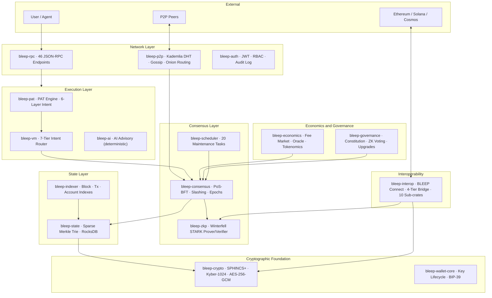
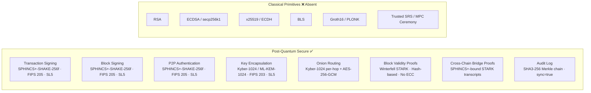
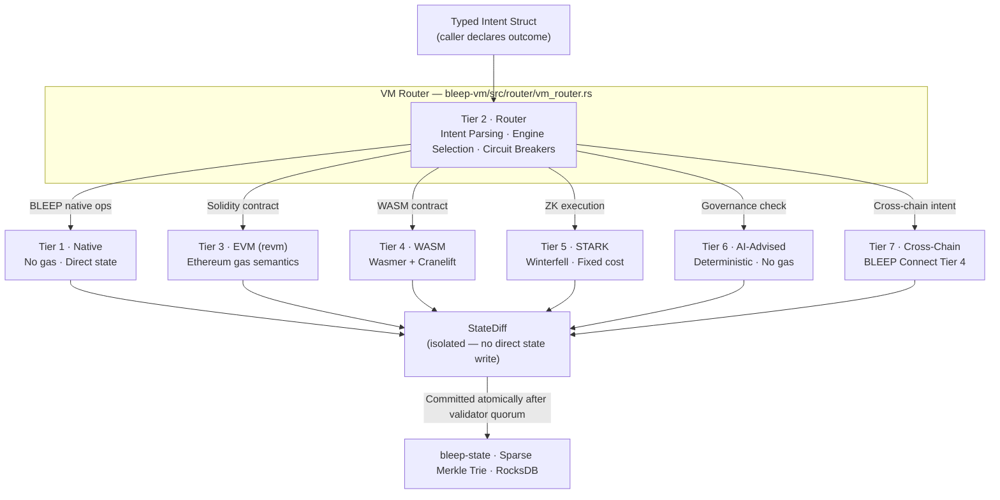
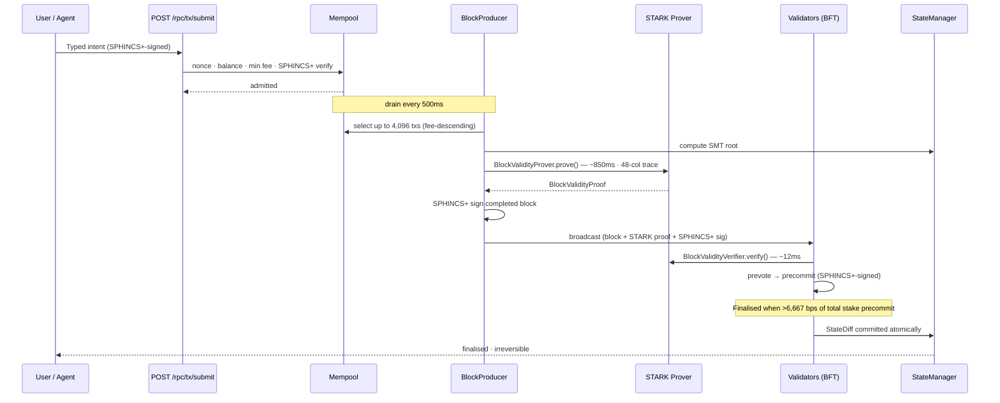
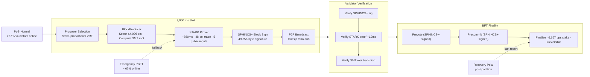
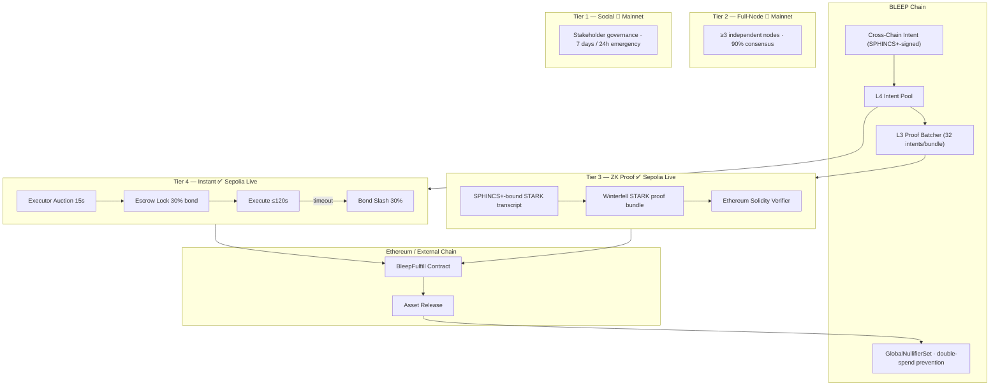
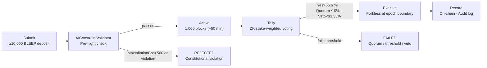

# BLEEP · Quantum Trust Network

### *Proven Execution · Quantum Foundation · Intent Native*

**A Post-Quantum Cryptographic Foundation for Verifiable Decentralized Execution**

**WHITEPAPER — Protocol Version 5**

Muhammad Attahir · May 2026

[bleepecosystem.com](https://bleepecosystem.com) · [github.com/BleepEcosystem/BLEEP-v1](https://github.com/BleepEcosystem/BLEEP-v1)

> **Disclaimer:** This document is provided for informational purposes only. It does not constitute financial advice, investment advice, or an offer to sell securities or digital assets. All protocol parameters and source references correspond to Protocol Version 5.

---

## Abstract

Every existing distributed execution protocol accepts block validity on the basis of validator consensus — not mathematical proof. When a block is finalised, it is finalised because a supermajority of validators signed it, not because any party has independently verified that its state transition is correct. Simultaneously, the cryptographic foundations of these systems — ECDSA, secp256k1, x25519 — are vulnerable to polynomial-time attack by Shor's algorithm on a sufficiently capable fault-tolerant quantum processor, exposing their historical transaction records to retroactive decryption by adversaries archiving signed data today.
This paper describes BLEEP, a distributed execution environment investigating both problems in a single implementation. Every block produced by BLEEP carries a Winterfell STARK validity proof — a hash-based, transparent, post-quantum secure construction requiring no trusted setup ceremony — generated before broadcast and independently verified by each validator before any vote is cast. Block correctness is not assumed from consensus; it is proven. Transaction signing, peer authentication, key encapsulation, and proof verification are secured exclusively by NIST-finalized post-quantum primitives: SPHINCS+-SHAKE-256f-simple (FIPS 205, Security Level 5) and Kyber-1024/ML-KEM-1024 (FIPS 203, Security Level 5). No classical public-key primitive is present on any sensitive path. No migration is required — because no classical primitive was introduced.

Protocol Version 5 presents the following empirical measurements from a live implementation: Winterfell STARK block validity proofs averaging ~850 ms generation and ~12 ms verification on reference hardware (8-core, 32 GB RAM) within a 3,000 ms slot budget; SPHINCS+ signatures of 49,856 bytes per transaction, producing approximately 204 MB of aggregate signature data per 4,096-transaction block; an internal security audit resolving all Critical and High findings across 16,127 lines of Rust; and a 72-hour adversarial test suite across 10 scenarios with all passing.
These measurements are empirical data on the practical overhead of combining STARK-based execution proofs with NIST-finalized post-quantum primitives in a live distributed system — constraints directly relevant to Ethereum's long-term trajectory toward provable execution and post-quantum migration.

## 1. Introduction

### 1.1 The Harvest-Now, Decrypt-Later Problem

Shor's algorithm, executed on a sufficiently large fault-tolerant quantum processor, reduces integer factorization and discrete-logarithm computation to polynomial time. This breaks RSA, finite-field Diffie-Hellman, and all elliptic-curve schemes, including the secp256k1 curve used by Bitcoin and Ethereum.

The operationally significant threat is **archival**. Every transaction broadcast on a classical blockchain is a permanent public record. An adversary can archive ciphertexts and signed transactions now and apply quantum decryption retroactively when capable hardware becomes available. This is the **harvest-now, decrypt-later threat model**. The historical record of a classical blockchain is a cryptographic liability that grows monotonically with time.

### 1.2 The Migration Problem

A protocol that launches with classical cryptography and plans a post-quantum migration inherits a coordination problem that history shows cannot be cleanly solved. Validators, wallets, bridges, indexers, and all tooling must upgrade simultaneously. HTTPS migration took over a decade and is still not complete.

**BLEEP eliminates this problem by not having it.** Post-quantum from genesis means no migration coordination, no ecosystem split, and no retroactive liability.

### 1.3 The Execution Problem

Every existing Layer 1 asks validators and users to trust that a block's state transition was computed correctly. There is no independently verifiable proof. When a block is accepted, it is accepted on the basis of validator signatures — not mathematical proof of execution validity.

BLEEP solves both problems simultaneously. Every block includes a Winterfell STARK validity proof generated before broadcast, verified independently by every validator. Block correctness is not voted upon — it is proven.

### 1.4 Design Goals

- Post-quantum security at Security Level 5 on all signature, key-encapsulation, and zero-knowledge proof paths, with no classical fallback.
- Proven execution: every block ships with a Winterfell STARK validity proof, generated before broadcast and verified before any vote is cast.
- Intent-native runtime: callers express outcomes, not instructions; the VM router resolves execution path automatically.
- Deterministic protocol execution: byte-identical outputs on every honest node running the same software version.
- Constitutional parameter immutability: enforced by Rust const_assert! — cannot be altered by governance vote or software upgrade.
- Modular separation of concerns: 29 crates with acyclic dependency graphs enforced at build time.
- Trustless cross-chain verification through a tiered bridge architecture requiring no permanently privileged operator.
- Auditability by default: every security-relevant event committed to a tamper-evident, restart-persistent audit log.

---

## 2. System Overview

### 2.1 Definition: Quantum Trust Network

A Quantum Trust Network is a distributed execution system in which transaction validity, node identity, network message authentication, and zero-knowledge proof verification are enforced exclusively using cryptographic primitives believed to resist attacks by both classical PPT adversaries and quantum QPT adversaries equipped with Shor's algorithm, as formalized in NIST FIPS 203 and FIPS 205, and in hash-based transparent proof systems.

### 2.2 Architecture Overview

*Figure 1: BLEEP System Architecture — 29-crate Cargo workspace with acyclic dependency graph*

### 2.3 Principal Subsystems

| **Subsystem**   | **Primary Crates**                         | **Responsibility**                                                 |
|-----------------|--------------------------------------------|--------------------------------------------------------------------|
| Cryptographic   | bleep-crypto, bleep-zkp, bleep-wallet-core | PQ signatures, key encapsulation, STARK proofs, key lifecycle      |
| Consensus       | bleep-consensus, bleep-scheduler           | Block production, STARK proof pipeline, finality, slashing, epochs |
| State & Storage | bleep-state, bleep-indexer                 | Sparse Merkle Trie, RocksDB, shard lifecycle, self-healing         |
| Execution       | bleep-vm, bleep-pat, bleep-ai              | 7-tier VM, intent resolution, deterministic AI advisory            |
| P2P Network     | bleep-p2p, bleep-rpc, bleep-auth           | Node discovery, gossip, onion routing, authentication              |
| Interop         | bleep-interop (10 sub-crates)              | 4-tier cross-chain bridge, intent pool, ZK proof relay             |
| Economics       | bleep-economics, bleep-governance          | Tokenomics, fee market, ZK voting, forkless upgrades               |

### 2.4 The Four Pillars

| **Pillar**               | **What it means**                                           | **How it is implemented**                                                         |
|--------------------------|-------------------------------------------------------------|-----------------------------------------------------------------------------------|
| Proven Execution         | Every block ships with a cryptographic proof of correctness | Winterfell STARK BlockValidityProof — generated pre-broadcast, verified pre-vote  |
| Intent Native            | Callers express outcomes, not instructions                  | PAT engine + 7-tier VM router — intent resolved to optimal execution path         |
| Quantum Foundation       | No classical public-key primitive on any sensitive path     | SPHINCS+ (FIPS 205) + Kyber-1024 (FIPS 203) at Security Level 5 — from block zero |
| Constitutional Integrity | Supply cap, inflation, finality cannot be changed by anyone | Rust const_assert! — violations do not compile                                    |

---

## 3. Cryptographic Model

All cryptography on sensitive paths is post-quantum. No classical fallback exists. No trusted setup ceremony is required for any proof system.

### 3.1 Post-Quantum Boundary

*Figure 2: Post-Quantum Cryptographic Boundary — secured paths (left) and absent classical primitives (right)*

### 3.2 Signature Scheme — SPHINCS+-SHAKE-256f-simple (FIPS 205)

| **Parameter**       | **Value**                                                      |
|---------------------|----------------------------------------------------------------|
| NIST Standard       | FIPS 205 (SLH-DSA)                                             |
| Security Level      | 5 — ≥256-bit post-quantum security                             |
| Security Assumption | One-wayness of SHAKE-256 (hash-based)                          |
| Public Key          | 64 bytes                                                       |
| Secret Key          | 128 bytes (Zeroizing\<Vec\<u8\>\> — zeroed on drop)            |
| Signature           | 49,856 bytes                                                   |
| Crate               | pqcrypto-sphincsplus v0.7.2                                    |
| Usage               | Transaction signing, block signing, P2P message authentication |

> **Bandwidth:** Raw SPHINCS+ signature data is ~24.3 MB per block at 512 tx/block. The **Signature Availability Layer** (live, Protocol Version 5) reduces block-gossip bandwidth to **~320 KB per block (~98.7% reduction)** via a Blake3 Merkle commitment (`sig_commitment_root`) over SHA3-256(sig_i), bound into both the SPHINCS+ block signature and the 68-column extended STARK proof. Receiving validators verify authenticity without individual signatures.

### 3.3 Key Encapsulation — Kyber-1024 / ML-KEM-1024 (FIPS 203)

| **Parameter**       | **Value**                                                         |
|---------------------|-------------------------------------------------------------------|
| NIST Standard       | FIPS 203 (ML-KEM)                                                 |
| Security Level      | 5 — ≥256-bit post-quantum security                                |
| Security Assumption | Hardness of Module-LWE (lattice-based)                            |
| Public Key          | 1,568 bytes                                                       |
| Secret Key          | 3,168 bytes (Zeroizing\<Vec\<u8\>\> — zeroed on drop)             |
| Output              | 1,568-byte ciphertext + 32-byte shared secret                     |
| Crate               | pqcrypto-kyber v0.8.1                                             |
| Usage               | Validator binding, peer KEM, wallet key management, onion routing |

### 3.4 Zero-Knowledge Proofs — Winterfell STARK (FRI-based)

| **Property**        | **Value**                                                            |
|---------------------|----------------------------------------------------------------------|
| Construction        | FRI-based STARK over 128-bit prime field                             |
| Trusted Setup       | None — fully transparent                                             |
| Post-Quantum Secure | Yes — reduces to collision resistance of BLAKE3 / SHA3-256           |
| Trace Width         | 48 columns (BlockValidityAir)                                        |
| Public Inputs       | block_index, epoch_id, tx_count, merkle_root_hash, validator_pk_hash |
| Proof Generation    | ~850 ms on reference hardware (8-core, 32 GB RAM)                    |
| Proof Verification  | ~12 ms on reference hardware                                         |
| Slot Budget         | 3,000 ms — proof generation fits within one slot                     |
| Crate               | winterfell v0.13.1                                                   |

---

## 4. Execution Model

### 4.1 Intent-Native VM — 7-Tier Dispatch

BLEEP's VM resolves intent — not bytecode. Callers declare **what** they want. The Router (Tier 2) determines **how** it executes, selecting the optimal engine automatically.

*Figure 3: 7-Tier Intent-Driven VM — execution dispatch from typed intent through StateDiff isolation*

| **Tier** | **Engine**         | **Scope**                                          | **Gas Model**              |
|----------|--------------------|----------------------------------------------------|----------------------------|
| 1        | Native             | BLEEP Transfer, stake, unstake, governance vote    | None                       |
| 2        | Router             | Intent parsing, engine selection, circuit breakers | Validation only            |
| 3        | EVM (revm)         | Ethereum-compatible Solidity contracts             | Ethereum gas semantics     |
| 4        | WASM (Wasmer)      | WASM contracts (Cranelift backend)                 | Configurable fuel metering |
| 5        | STARK (Winterfell) | ZK execution, public input verification            | Fixed cost per verifier op |
| 6        | AI-Advised         | Constraint validation — advisory, off-chain only   | Deterministic; no gas      |
| 7        | Cross-Chain        | BLEEP Connect Tier 4 instant intent dispatch       | Protocol fee in bps        |

### 4.2 Transaction Lifecycle

*Figure 4: Transaction Lifecycle — from submission through STARK proof generation to irreversible BFT finality*

### 4.3 StateDiff Isolation

The VM never writes to bleep-state directly. Execution produces a StateDiff object committed atomically by bleep-state only after validator quorum. This guarantees:

- Clean separation between execution and state commitment
- Dry-run simulation without side effects
- Deterministic rollback safety
- Byte-identical state roots across all honest validators given identical inputs

### 4.4 Deterministic State Transition

Let **S**_t_ denote the complete protocol state at block index t, and T the canonically ordered sequence of validated transactions. The protocol defines a deterministic total function F such that **S**_t+1_ = F(**S**_t_, T). Given identical **S**_t_ and identical T, every correct implementation produces identical **S**_t+1_ — including the Sparse Merkle Trie root committed in the block header. Non-determinism on any consensus-critical path is a protocol bug.

---

## 5. Consensus

### 5.1 Validator Model and Fault Assumptions

Let V = {v1, …, vn} be the active validator set at epoch e. Each vi carries:

- A SPHINCS+ verification key (transaction and block signing)
- A Kyber-1024 encapsulation key (peer channels and onion routing)
- A stake si in microBLEEP (determines vote weight and slashing exposure)

**Safety is guaranteed when Byzantine stake f \< S/3** (total staked supply S).

### 5.2 Consensus Pipeline

*Figure 5: Consensus Pipeline — block production, STARK proof generation, BFT voting, and irreversible finality*

### 5.3 Three Deterministic Consensus Modes

| **Mode**   | **Trigger**                           | **Behaviour**                                           |
|------------|---------------------------------------|---------------------------------------------------------|
| PoS-Normal | Primary — \>67% validators responsive | Stake-proportional proposer selection, 3,000 ms slots   |
| Emergency  | \<67% validators responsive           | Reduced validator set, PBFT, safety-first               |
| Recovery   | Post-partition re-anchor              | Deterministic re-sync from last finalised block via PoW |

### 5.4 Finality

Finalisation requires precommits representing **\>6,667 bps (66.67%) of total staked supply**. Finalisation is **irreversible**. Long-range reorgs are rejected at FinalityManager — verified in the adversarial test suite at depths of 10 and 50 blocks.

### 5.5 Slashing

| **Violation**                  | **Penalty**                               | **Source Constant**          |
|--------------------------------|-------------------------------------------|------------------------------|
| Double-sign                    | 33% of stake burned; validator tombstoned | double_signing_penalty: 0.33 |
| Equivocation                   | 25% of stake burned                       | equivocation_penalty: 0.25   |
| Downtime                       | 0.1% per consecutive missed block         | downtime_penalty_per_block   |
| Tier 4 bridge executor timeout | 30% of executor bond                      | EXECUTION_TIMEOUT = 120s     |

---

## 6. Cross-Chain Interoperability — BLEEP Connect

BLEEP Connect is a four-tier cross-chain bridge architecture implemented across ten sub-crates within bleep-interop. No tier requires a permanently privileged operator or a trusted multisig key set.

*Figure 6: BLEEP Connect 4-Tier Bridge Architecture — from BLEEP Chain through tier verification to external chain settlement*

| **Tier**      | **Protocol**                         | **Latency** | **Security Basis**                               | **Status**     |
|---------------|--------------------------------------|-------------|--------------------------------------------------|----------------|
| 4 — Instant   | Executor auction + escrow            | 200ms – 1s  | Economic: 30% bond slashed on timeout            | Live (Sepolia) |
| 3 — ZK Proof  | SPHINCS+-bound STARK commitment      | 10 – 30s    | Cryptographic: PQ-secure, zero trusted operators | Live (Sepolia) |
| 2 — Full-Node | Multi-client verification (≥3 nodes) | Hours       | 90% consensus across independent nodes           | Mainnet target |
| 1 — Social    | Stakeholder governance               | 7 days      | Full governance consensus                        | Mainnet target |

### 6.1 Tier 4 — Instant Intent Execution

Executor auction window: 15s · Execution timeout: 120s · Protocol fee: 10 bps · Bond slash on timeout: 30% · Latency: 200ms – 1s · Security: economic via slash bond.

### 6.2 Tier 3 — ZK Proof Bridge

Batches up to 32 cross-chain intents into proof bundles. ProofGenerator constructs a deterministic transcript, binds it with a SPHINCS+ signature, and generates a Winterfell STARK commitment. ProofVerifier verifies using the post-quantum public key. No structured reference string or MPC ceremony is required. Double-spend prevention uses GlobalNullifierSet with atomic WriteBatch (sync=true).

### 6.3 Chain Adapters

Chain adapters registered at boot: **ETH, BSC, SOL, COSMOS, DOT**. Additional chains activate via governance vote.

---

## 7. Economics and Tokenomics

### 7.1 Constitutional Parameters

These four parameters are enforced by Rust const_assert!. A code change that violates them does not compile. They cannot be altered by governance vote, software upgrade, or validator supermajority.

| **Parameter**               | **Value**         | **Enforcement**                              |
|-----------------------------|-------------------|----------------------------------------------|
| Maximum supply              | 200,000,000 BLEEP | MAX_SUPPLY const_assert in tokenomics.rs     |
| Maximum per-epoch inflation | 500 bps (5%)      | MAX_INFLATION_RATE_BPS const_assert          |
| Fee burn floor              | 2,500 bps (25%)   | FEE_BURN_BPS const_assert in distribution.rs |
| Minimum finality threshold  | \>6,667 bps       | FinalityManager enforcement                  |

### 7.2 Token Distribution

| **Allocation**       | **Tokens** | **%** | **Launch Unlock** | **Vesting**                                      |
|----------------------|------------|-------|-------------------|--------------------------------------------------|
| Validator Rewards    | 60,000,000 | 30%   | 10,000,000        | Emission decay schedule                          |
| Ecosystem Fund       | 50,000,000 | 25%   | 5,000,000         | 10-year linear; governance disbursement          |
| Community Incentives | 30,000,000 | 15%   | 5,000,000         | Governance-triggered release                     |
| Foundation Treasury  | 30,000,000 | 15%   | 5,000,000         | 6-year linear; governance spending               |
| Core Contributors    | 20,000,000 | 10%   | 0                 | 1-year cliff + 4-year linear; immutable on-chain |
| Strategic Reserve    | 10,000,000 | 5%    | 0                 | Governance-controlled unlock                     |

### 7.3 Validator Emission Schedule

| **Year** | **Rate** | **Annual Emission (BLEEP)** | **Cumulative** | **Pool Remaining** |
|----------|----------|-----------------------------|----------------|--------------------|
| 1        | 12%      | 7,200,000                   | 7,200,000      | 52,800,000         |
| 2        | 10%      | 6,000,000                   | 13,200,000     | 46,800,000         |
| 3        | 8%       | 4,800,000                   | 18,000,000     | 42,000,000         |
| 4        | 6%       | 3,600,000                   | 21,600,000     | 38,400,000         |
| 5+       | 4%       | ~2,400,000                  | —              | Decreases annually |

### 7.4 Fee Market

EIP-1559-style base fee. Fee split: 25% burned / 50% validator rewards / 25% treasury — enforced by compile-time assertion that splits sum to exactly 10,000 bps. Minimum base fee: 1,000 microBLEEP. Maximum base fee change per block: 1,250 bps (12.5%).

---

## 8. Governance

### 8.1 Proposal Lifecycle

*Figure 7: Governance Proposal Lifecycle — from submission through ZK tally to forkless execution*

LiveGovernanceEngine processes typed proposals through a six-stage lifecycle: Submit → AIConstraintValidator pre-flight → Active → Tally → Execute → Record. A proposal that would set MaxInflationBps above 500 is rejected at pre-flight and never reaches a vote.

### 8.2 Governance Parameters (Testnet)

| **Parameter**   | **Value**                                 |
|-----------------|-------------------------------------------|
| Voting period   | 1,000 blocks (~50 min at 3s block time)   |
| Quorum          | 1,000 bps (10% stake participation)       |
| Pass threshold  | 6,667 bps (66.67% of participating stake) |
| Veto threshold  | 3,333 bps (33.33%)                        |
| Minimum deposit | 10,000 BLEEP                              |

### 8.3 ZK Voting

Votes are cast as EncryptedBallot structs. EligibilityProof establishes voting power without revealing validator identity. TallyProof enables independent tally verification without revealing individual votes.

Voter roles: Validator (1.0×) · Delegator (0.5×) · Community token holder (0.1×).

### 8.4 Constitutional Constraints

Four parameters are constitutionally immutable, enforced by Rust const_assert!. A code change that violates them does not compile. They cannot be altered by any governance vote, software upgrade, or validator supermajority.

### 8.5 Forkless Upgrades

ForklessUpgradeEngine activates hash-committed upgrade payloads at epoch boundaries only. Version progression is monotonically enforced — a version mismatch halts the chain. No node restart required. Partial upgrades are rejected atomically.

---

## 9. Security

### 9.1 Threat Model

BLEEP's security analysis considers three adversary classes:

- Classical PPT adversary — targets 256-bit security on all operations.
- Quantum QPT adversary — BLEEP's post-quantum boundary maintains 256-bit security; no path is broken by Shor's algorithm.
- Byzantine validator adversary — controls f \< S/3 of staked supply; BFT safety holds unconditionally.

### 9.2 Independent Security Audit — Sprint 9

16,127 lines of Rust across six crates reviewed.

| **Severity**  | **Count** | **Resolved** | **Acknowledged** | **Outcome**                                                    |
|---------------|-----------|--------------|------------------|----------------------------------------------------------------|
| Critical      | 2         | 2            | 0                | All resolved                                                   |
| High          | 3         | 3            | 0                | All resolved                                                   |
| Medium        | 4         | 3            | 1                | SA-M4: EIP-1559 design property; documented in THREAT_MODEL.md |
| Low           | 3         | 3            | 0                | All resolved                                                   |
| Informational | 2         | 1            | 1                | SA-I2: NTP drift guard — mainnet gate                          |
| Total         | 14        | 12           | 2                | Cleared for Phase 6 public testnet                             |

### 9.3 Adversarial Test Suite (72-hour Continuous)

| **Scenario**                | **Result** | **Invariant Verified**                           |
|-----------------------------|------------|--------------------------------------------------|
| ValidatorCrash(1)           | PASS       | f=1 \< 2.33; consensus resumed                   |
| ValidatorCrash(2)           | PASS       | f=2 \< 2.33; consensus resumed                   |
| NetworkPartition(4/3)       | PASS       | Majority partition continued; healed cleanly     |
| LongRangeReorg(10)          | PASS       | Rejected at FinalityManager                      |
| LongRangeReorg(50)          | PASS       | Rejected at FinalityManager                      |
| DoubleSign(validator-0)     | PASS       | 33% slashed; tombstoned                          |
| TxReplay                    | PASS       | Rejected by nonce check                          |
| InvalidBlockFlood(1000)     | PASS       | Rejected at SPHINCS+ gate; peer rate-limited     |
| STARKProofTamper            | PASS       | Tampered proof rejected at BlockValidityVerifier |
| LoadStress(10,000 TPS, 60s) | PASS       | Max throughput; STARK proofs within slot budget  |

---

## 10. Scalability

### 10.1 Projected Performance — Simulated, Pre-Testnet

| **Metric**                     | **Value**                                   |
|--------------------------------|---------------------------------------------|
| Configuration                  | 10 shards, 4,096 tx/block, 3,000ms interval |
| Average TPS                    | 10,921 (target ≥10,000)                     |
| Peak TPS                       | 13,200                                      |
| Sustained minimum TPS          | 9,840                                       |
| Full-capacity block ratio      | 82.3%                                       |
| STARK proof generation (avg)   | ~850 ms per block                           |
| STARK proof verification (avg) | ~12 ms per block                            |

> These are projections from simulated workloads — 7 validators, controlled network latency, geographically concentrated nodes, uniform transaction mix. Actual throughput on a geographically distributed public testnet will be measured and published during Phase 6. STARK timings on reference 8-core, 32 GB RAM hardware.

### 10.2 Sharding

10 shards (NUM_SHARDS) in testnet configuration. Cross-shard transactions use TwoPhaseCommitCoordinator with deterministic coordinator selection from transaction hash — no privileged coordinator election. Stalled coordinators force-aborted by cross_shard_timeout_sweep every 60 seconds.

### 10.3 Self-Healing

SelfHealingOrchestrator tracks protocol health: Healthy → Degraded → Critical → Recovering. Low and medium severity faults self-correct. High and critical require quorum approval. All recovery actions are deterministic — identical fault evidence produces identical recovery actions on all honest validators.

---

## 11. Limitations

### 11.1 Post-Quantum Primitives Introduce Measurable Overhead

SPHINCS+-SHAKE-256f-simple produces 49,856-byte signatures. The Signature Availability Layer (Protocol Version 5) reduces per-block gossip bandwidth from ~24.3 MB (512 tx × 49,856 bytes raw) to ~320 KB (~98.7% reduction). The `sig_commitment_root` — a Blake3 Merkle root over SHA3-256(sig_i) for all block transactions — is stamped on the block before SPHINCS+ signing and committed into the extended STARK proof, so receivers verify authenticity without individual signatures. Kyber-1024 public keys are 1,568 bytes compared to 32-byte Curve25519 keys. Winterfell proof generation averages ~850–950 ms per block, within the 3,000 ms slot budget. These overheads are the direct, quantified cost of transparent post-quantum security with no trusted setup — accepted as an explicit design trade-off.

### 11.2 Signature Aggregation Not Yet Available

SPHINCS+ does not support aggregation: n validators produce n independent 49,856-byte signatures. Hash-based signature aggregation is a medium-term research direction.

### 11.3 Throughput Figures Are Simulated

TPS projections reflect simulated conditions: 7 validators, controlled network latency, geographically concentrated nodes, and a uniform transaction mix. Actual throughput will be measured during Phase 6 public testnet operation.

### 11.4 Ed25519 Present in Cargo.toml

Ed25519 is present for compatibility and is not used on any sensitive path when the quantum feature flag is active (default). It is scheduled for sunset in Phase 9.

### 11.5 Bridge Tiers 1 and 2 Not Yet Deployed

Tiers 3 and 4 of BLEEP Connect are live on Ethereum Sepolia. Tiers 1 and 2 are mainnet targets requiring governance infrastructure that activates at genesis. The cross-chain security model for institutional use cases depends on Tiers 1 and 2 being available — this is a pre-mainnet gate.

---

## 12. Future Work and Roadmap

| **Phase** | **Description**                                                                           | **Status**            |
|-----------|-------------------------------------------------------------------------------------------|-----------------------|
| Phase 1   | Foundation — workspace, crypto primitives, core types                                     | Complete              |
| Phase 2   | Consensus & State — PoS-BFT, Sparse Merkle Trie, epoch management                         | Complete              |
| Phase 3   | VM & Interoperability — 7-tier VM, PAT engine, BLEEP Connect                              | Complete              |
| Phase 4   | Self-Healing & AI Advisory — cross-shard 2PC, STARK circuit, DeterministicInferenceEngine | Complete              |
| Phase 5   | Hardening & Audit — chaos testing, fuzz targets, internal security audit                  | Complete              |
| Phase 6   | External Audit & Public Testnet — ≥50 validators, ≥6 continents, block explorer           | In Progress (Q2 2026) |
| Phase 7   | Mainnet Candidate — TGE, Ethereum bridge, client SDKs                                     | Planned (Q3-Q4 2026)  |
| Phase 8   | Ecosystem Expansion — Cosmos/Polkadot bridges, Move VM, zkEVM                             | Planned (2027)        |
| Phase 9   | Quantum-Safe Mainnet — mandatory PQ enforcement, Ed25519 sunset                           | Planned (2028+)       |

### 12.1 Signature Aggregation

The Signature Availability Layer (Sprint 10) resolves block-propagation bandwidth via Blake3 Merkle commitment over SHA3-256(sig_i). Hash-based Merkle multi-signature aggregation reducing validator vote bandwidth by O(log n) in validator count remains a medium-term research direction for Phase 8.

### 12.2 Phase 9 — Quantum-Safe Mainnet (2028+)

Mandatory SPHINCS+ enforcement across all transaction types, Ed25519 sunset, Kyber-1024 mandatory for all session key establishment, and bleep-vm BSL-1.1 → Apache 2.0 automatic conversion (2028-07-13).

---

## 13. Conclusion

BLEEP is a Quantum Trust Network: the first distributed execution protocol in which every block ships with a mathematical proof of its own correctness, every instruction is expressed as intent, and the entire cryptographic foundation is built on NIST-standardised post-quantum primitives — by construction, from genesis.

No classical public-key primitive or pairing-based construction is present on any cryptographically sensitive path. No trusted setup ceremony is required for any proof system. No migration path is needed — because the problem was solved before the protocol accumulated economic value and ecosystem dependencies.

Protocol Version 5 establishes the practical foundation for this design: SPHINCS+-signed blocks at a 3,000 ms slot interval, Kyber-1024 key encapsulation for all peer channels, Winterfell STARK block validity proofs benchmarked at ~850 ms generation and ~12 ms verification, a 72-hour adversarial test suite with all scenarios passing, an internal security audit with all Critical and High findings resolved, and projected throughput averaging 10,921 TPS across 10 shards under simulated conditions.

The four pillars — proven execution, intent-native runtime, quantum-native foundation, and constitutional integrity — are verifiable properties of the Protocol Version 5 codebase. Public testnet deployment in Phase 6 will validate these properties at the scale and adversarial conditions required for a globally adopted protocol.

---

## References

1.  Shor, P.W. (1994). Algorithms for quantum computation: discrete logarithms and factoring. Proceedings of the 35th Annual Symposium on Foundations of Computer Science.

2.  Banegas, G. et al. (2021). Concrete quantum cryptanalysis of binary elliptic curves. IACR Transactions on Cryptographic Hardware and Embedded Systems.

3.  Mosca, M. (2018). Cybersecurity in an era with quantum computers: will we be ready? IEEE Security & Privacy, 16(5), 38-41.

4.  Amann, J. et al. (2017). Mission accomplished? HTTPS security after DigiNotar. ACM IMC 2017.

5.  Grover, L.K. (1996). A fast quantum mechanical algorithm for database search. Proceedings of the 28th ACM STOC.

6.  NIST. (2024). Post-Quantum Cryptography Standardization. FIPS 203, FIPS 204, FIPS 205.

7.  Lamport, L., Shostak, R., and Pease, M. (1982). The Byzantine generals problem. ACM TOPLAS, 4(3), 382-401.

8.  Ben-Sasson, E. et al. (2018). Scalable, transparent, and post-quantum secure computational integrity. IACR ePrint 2018/046.

9.  Fischer, M.J., Lynch, N.A., and Paterson, M.S. (1985). Impossibility of distributed consensus with one faulty process. Journal of the ACM, 32(2), 374-382.

10. Winterfell STARK library. (2024). https://github.com/facebook/winterfell

11. Bernstein, D.J. and Lange, T. (2017). Post-quantum cryptography. Nature, 549, 188-194.

---

## Appendix A: Protocol Parameters

All values are drawn from the production Rust source at Protocol Version 5. Parameters marked (†) are constitutional and cannot be changed by governance vote or software upgrade.

### A.1 Consensus and Execution

| **Parameter**              | **Value**             | **Source Constant**        |
|----------------------------|-----------------------|----------------------------|
| Block interval             | 3,000 ms              | BLOCK_INTERVAL_MS          |
| Max transactions per block | 4,096                 | MAX_TXS_PER_BLOCK          |
| Blocks per epoch (mainnet) | 1,000                 | BLOCKS_PER_EPOCH           |
| Blocks per epoch (testnet) | 100                   | testnet-genesis.toml       |
| Finality threshold (†)     | \>6,667 bps           | FinalityManager            |
| Active shards              | 10                    | NUM_SHARDS                 |
| Double-sign slash          | 33% of stake          | double_signing_penalty     |
| Equivocation slash         | 25% of stake          | equivocation_penalty       |
| Downtime slash             | 0.1% per missed block | downtime_penalty_per_block |

### A.2 Cryptography and Networking

| **Parameter**           | **Value**               | **Source**                  |
|-------------------------|-------------------------|-----------------------------|
| SPHINCS+ signature size | 49,856 bytes            | pqcrypto-sphincsplus v0.7.2 |
| SPHINCS+ public key     | 64 bytes                | pqcrypto-sphincsplus v0.7.2 |
| SPHINCS+ secret key     | 128 bytes               | pqcrypto-sphincsplus v0.7.2 |
| Kyber-1024 public key   | 1,568 bytes             | pqcrypto-kyber              |
| Kyber-1024 secret key   | 3,168 bytes             | pqcrypto-kyber              |
| State trie depth        | 256 levels              | TRIE_DEPTH                  |
| Merkle proof size       | 8,192 bytes (fixed)     | SparseMerkleTrie            |
| Gossip max message size | 2,097,152 bytes (2 MiB) | MAX_GOSSIP_MSG_BYTES        |
| Gossip fanout           | 8                       | bleep-p2p                   |
| Kademlia k-bucket size  | 20                      | bleep-p2p                   |
| STARK trace columns     | 48                      | BlockValidityAir            |
| STARK proof setup       | None (transparent)      | bleep-zkp                   |
| JWT entropy minimum     | 3.5 bits/byte           | session.rs                  |

### A.3 Economics and Token

| **Parameter**               | **Value**                 | **Source Constant**        |
|-----------------------------|---------------------------|----------------------------|
| Maximum supply (†)          | 200,000,000 BLEEP         | MAX_SUPPLY                 |
| Token decimals              | 8                         | tokenomics.rs              |
| Initial circulating supply  | 25,000,000 (12.5%)        | INITIAL_CIRCULATING_SUPPLY |
| Max per-epoch inflation (†) | 500 bps (5%)              | MAX_INFLATION_RATE_BPS     |
| Fee burn split (†)          | 2,500 bps (25%)           | FEE_BURN_BPS               |
| Validator fee split         | 5,000 bps (50%)           | FEE_VALIDATOR_REWARD_BPS   |
| Treasury fee split          | 2,500 bps (25%)           | FEE_TREASURY_BPS           |
| Min base fee                | 1,000 microBLEEP          | MIN_BASE_FEE               |
| Max base fee                | 10,000,000,000 microBLEEP | MAX_BASE_FEE               |

### A.4 Cross-Chain Bridge

| **Parameter**              | **Value**                       | **Source Constant**          |
|----------------------------|---------------------------------|------------------------------|
| Tier 3 proof type          | SPHINCS+-bound STARK commitment | bleep-connect-layer3-zkproof |
| Tier 3 batch size          | 32 intents                      | L3_BATCH_SIZE                |
| Tier 3 setup requirement   | None (transparent)              | bleep-zkp                    |
| Tier 4 execution timeout   | 120 s                           | EXECUTION_TIMEOUT            |
| Tier 4 protocol fee        | 10 bps (0.1%)                   | PROTOCOL_FEE_BPS             |
| Tier 4 bond slash          | 30%                             | EXECUTOR_SLASH_BPS           |
| Tier 2 consensus threshold | 90%                             | CONSENSUS_THRESHOLD          |
| Tier 2 minimum verifiers   | 3                               | MIN_VERIFIER_NODES           |

---

*BLEEP · Quantum Trust Network · Protocol Version 5 · May 2026*

*This document does not constitute financial or investment advice.*

**© 2026 Muhammad Attahir — Apache 2.0 Licence — bleepecosystem.com**

